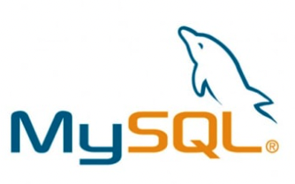
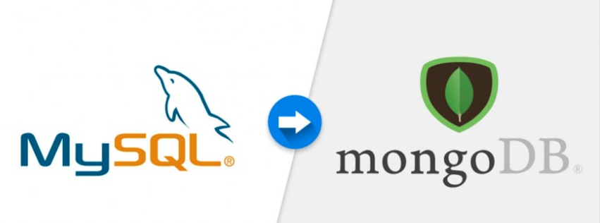

# Movie Database Management System

Welcome to our Movie Database Management System! We've created a robust SQL database that's perfect for handling all your movie-related data. From managing movie information to user profiles and even handling sub-accounts. Our system includes a range of powerful features inspired by popular streaming services like Netflix.

## Features:
### 1. Comprehensive Movie Data Management
Easily manage and organize your movie collection with our intuitive database. Store and retrieve detailed information about movies, including titles, genres, release dates, and more. Whether you're a cinephile or just looking for entertainment, our system ensures efficient data organization.

### 2. Intelligent Triggers and Procedures
Experience seamless automation with our smart triggers and procedures. We've implemented these to enhance your database experience. Triggers help maintain data integrity by automatically responding to changes, while procedures streamline complex tasks, making data manipulation a breeze.

### 3. User Profile Management
Create and manage user profiles effortlessly. Our system provides a user-friendly interface for setting up and customizing user accounts. Enjoy a personalized experience as you curate your movie preferences and track your watching history.

### 4. Sub-Account Functionality
Want to share your movie collection with your loved ones? Our sub-account feature lets you attach multiple sub-accounts to a single main profile. Each family member can have their own unique preferences and viewing history, enhancing the overall user experience.

### 5. Netflix-Inspired Functionality
We've taken inspiration from streaming giants like Netflix to bring you a set of common functionality queries. Whether you're searching for trending movies, exploring top-rated films, or discovering hidden gems, our queries will help you find exactly what you're looking for.

# SQL to NoSQL Database Migration and Query Performance Comparison 

In our constant pursuit of innovation, we took a step further by migrating our SQL-based Movie Database Management System to a dynamic NoSQL solution using MongoDB. This transition opens up a whole new realm of possibilities and challenges, allowing us to explore the world of unstructured data while comparing the query performance between the two database systems.

## The Migration Journey 
### From SQL to NoSQL: 
Our team embarked on an exciting journey to convert our robust SQL database into a MongoDB-powered NoSQL structure. This migration required us to rethink our data model and adapt it to MongoDB's flexible document-based approach. Fields that were once organized in tables are now stored as documents, allowing us to capture complex hierarchical relationships more intuitively.

### Data Transformation: 
The migration process involved transforming our existing SQL data into a suitable format for MongoDB. This required mapping relationships, adjusting data types, and optimizing the structure for MongoDB's document-oriented storage.

### New Possibilities: 
Embracing a NoSQL database has empowered us to manage unstructured data more efficiently. We can now accommodate diverse information about movies, user profiles, and preferences without rigid schemas, providing a more adaptable and scalable solution.

## Comparing Query Performance 
### The Benchmark: 
With both SQL and NoSQL versions of our database up and running, we delved into comprehensive performance analysis. We curated a series of common functionality queries inspired by our Netflix-like features and tested them against both database systems.

### Metrics: 
Our comparison included measuring query execution times, resource utilization, and scalability. We explored scenarios such as searching for trending movies, retrieving user profiles with their preferences, and tracking movie ratings and reviews.

### Insights and Findings
#### SQL Advantages: 
Traditional SQL databases excel in structured data management and complex queries involving multiple tables. They maintain data integrity through ACID transactions and are well-suited for applications with fixed schemas.

#### NoSQL Advantages:
MongoDB's NoSQL approach shines when handling large volumes of unstructured or semi-structured data. It's flexibility and horizontal scalability make it ideal for applications with evolving schemas and high write loads.

#### Query Performance: 
We discovered that for certain complex queries involving multiple joins, SQL databases exhibited better performance due to their optimized relational capabilities. However, MongoDB showcased impressive speed when handling queries involving nested data and real-time analytics.
